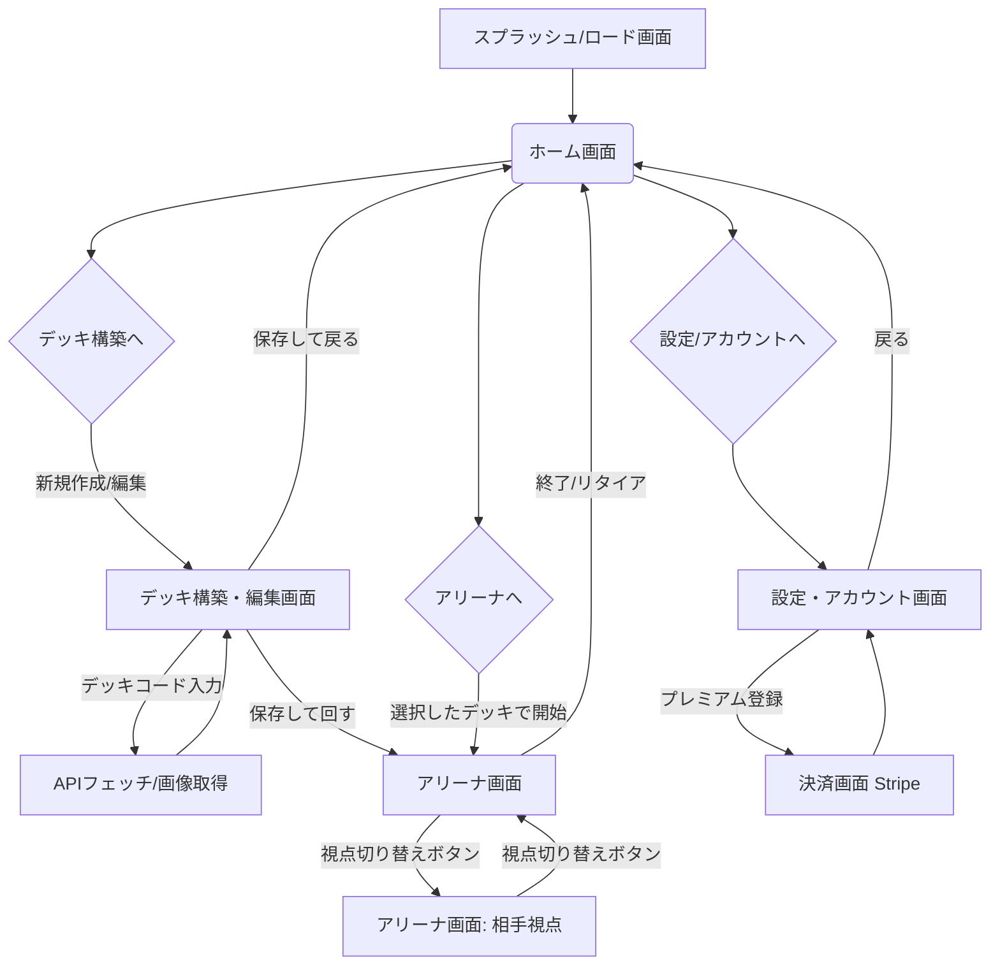

# 02. 画面遷移図 (Screen Transitions)

アプリ全体の基本的な画面の繋がり方（ナビゲーションフロー）を定義します。

## メインフロー

## サブフロー：アリーナ内部のアクション（モーダル・オーバーレイ遷移）

アリーナ画面（Battle Arena）はシングルページアプリケーション（SPA）として動作し、画面遷移を伴わずオーバーレイで情報を処理します。

1. **カードアクションメニュー**
   - トリガー: 盤面のカードをタップ（またはクリック）
   - 表示: カードの中心からポップアップ（Action Popup Modal）
   - 行動: ダメカンの増減、特性の宣言、ワザの宣言、にげる、トラッシュへ送る等を実行
   - 終了: メニュー外をタップするか「閉じる」アクションでモーダルが消去され盤面に戻る。

2. **山札（デッキ）操作モーダル**
   - トリガー: 山札をタップ 
   - 表示: 「山札を見る（サーチ）」「n枚ドロー」「シャッフル」の選択肢
   - 行動（例: サーチ）: 山札内の全カードがグリッド状に前面に広がり、選択したカードを手札やベンチに移動させる。選択終了後、自動でシャッフル処理が入り盤面に戻る。

3. **バトルログ（Log）**
   - トリガー: 画面右上の「Log」ボタンをタップ
   - 表示: 画面の右側または左側からドロワー（サイドパネル）がスライドイン
   - 内容: これまでの行動（例: "ハイパーボールを使用", "ポケモンスタジアムを配置"）の履歴を閲覧。
   - 終了: ドロワー外をタップするか、閉じるボタンでスライドアウト。
